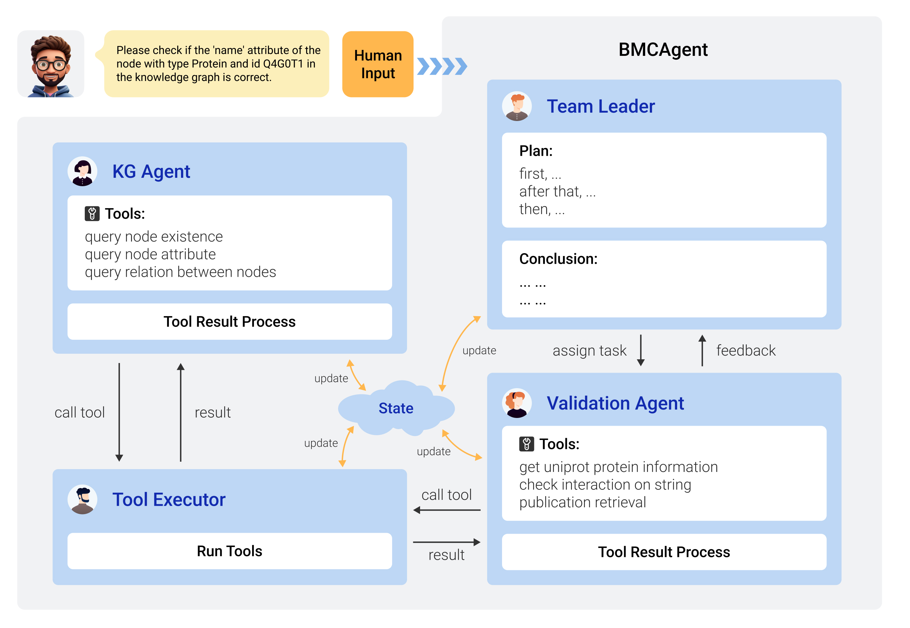

# Intro
We propose a biomedical knowledge-graph agent BKGAgent, a multi-agent framework based on LangGraph, which is capable of retrieving information in knowledge graph and cross-validate its correctness with multiple information sources.  
Our framework is comprised of three agents, namely the team leader for the progress control, the KG agent for the information retrieval in KG, and the validation agent for checking the correctness of the information from KG, simulating the workflow of a human research team where a leader supervises the assistants' work and makes the final decision given the feedback from them. Besides, the tool executor is solely responsible for executing the tool agent specified.  
When a user assigns a task, the leader initially breaks down the task and announces the plan. Then the KG agent is activated to retrieve task-related information from the KG. This involves specifying the tool and its arguments to the tool executor, interpreting the tool result, and communicating it back to the leader. After that, the validation agent is called for verification with a similar workflow to that of the KG agent. Finally, a conclusion will be drawn by the leader and returned to the user.  


# Code Framework
```
KGCheck  
|-- README.md  
|-- evalutation
|   `-- evaluate.py
|-- kg_toolbox                              # KG tool box
|   |-- graphdb_connector                   # Graph database connector
|   |   |-- __init__.py
|   |   |-- ckg_config.yml
|   |   |-- connector.py
|   |   |-- connector_config.yml
|   |   `-- query_utils.py
|   `-- kg_tools.py                         # KG tools
|-- retrieve_toolbox
|   |-- __init__.py
|   |-- corpus_based_retrieve.py
|   `-- web_api.py
|-- agents.py                               # Define multi Agents(Leader, KG, Validation, Tool Executor)
|-- prompts.py                              # Define prompts for the agents
|-- team.py                                 # Main script
`-- tool_box.py
```

# Getting Started
Configure the model information and api key in .env
```
python -m tasks.KGCheck.team
```